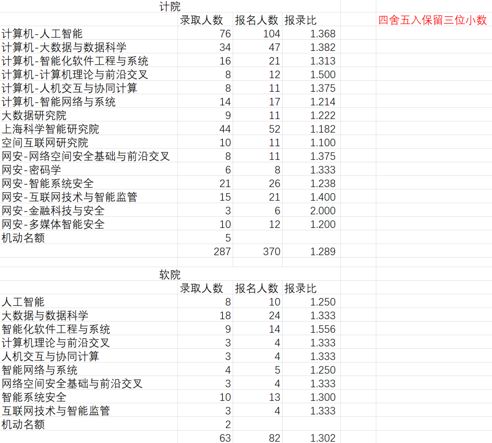
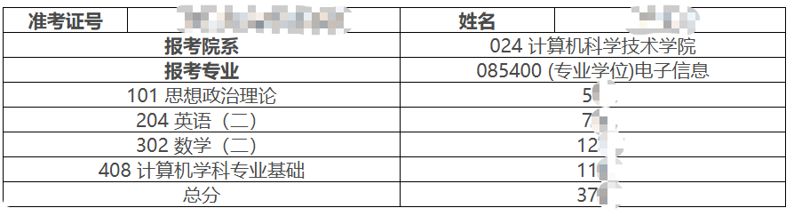
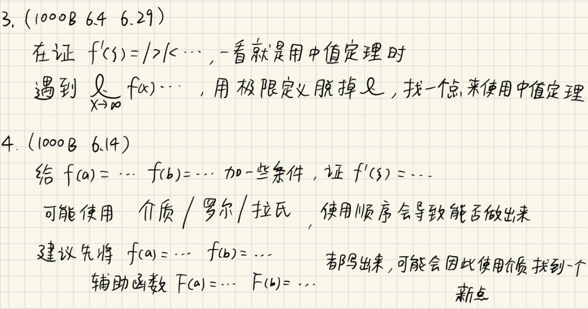
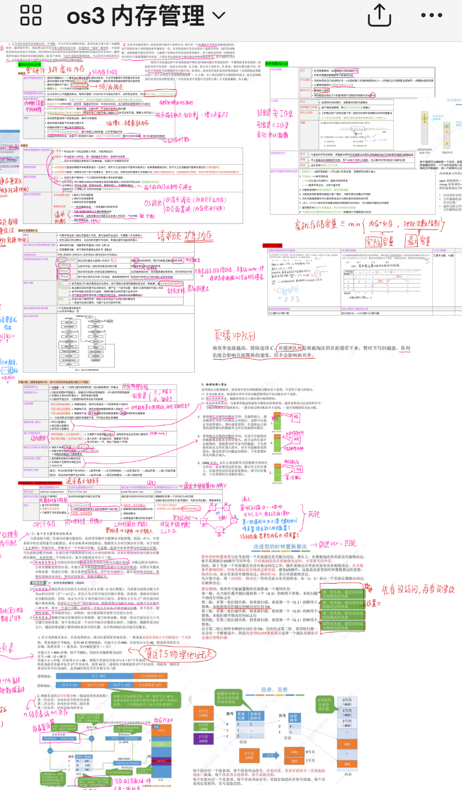
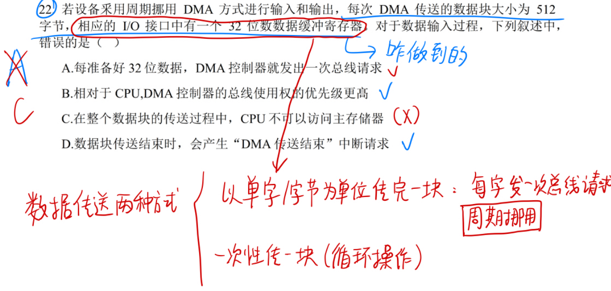
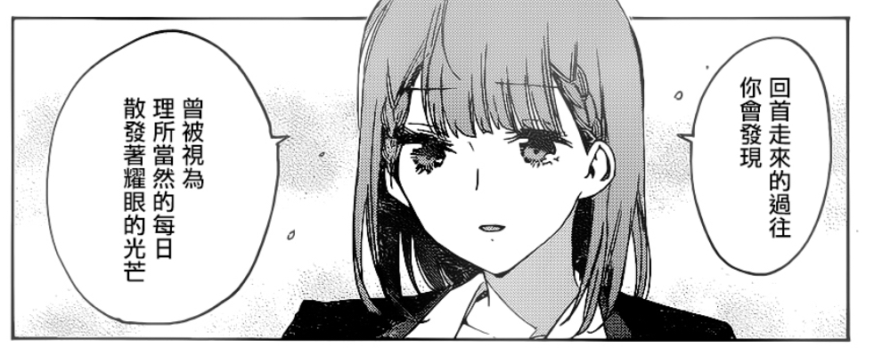

**Warning：以下内容仅供参考，请结合个人自身以及考研招生政策来随机应变。**

# 关于科研和读研

首先科研是这样的过程：

1. 你读论文学习
2. 想到一个idea，做实验跑一跑
3. 不能work，回到第1/2步
4. 能work，写paper
5. paper不被接收，修改论文、论文再投或者回到第1/2步
6. paper被接收了，bravo！

当然也有并不是一直这么循环的，比如实验室主要是做横向课题的，然后在做横向课题的时候你遇到了一个可以写成paper的点，老师会鼓励你去写这个paper，这样就进入第4步。

其次，在大部分老师手下，学生属于是散养的，老师只能给你idea和帮你修改论文，读研中最大的帮助应该主要是组里的师兄师姐给你的。所以说，读研真的是读书吗？我的建议是把读研当成工作，老师当成leader，师兄师姐当成mentor，leader/mentor可以帮助你，但你不是去被教育的，你是被应聘去工作的，要自己去学习。

最后，读研的目的是为了延缓三年就业（三年后真的能找到比现在秋招强的工作吗）？做科研（能坚持下去科研吗，做科研对于找工作如果没有帮助怎么办）？想读博（能坚持下去科研吗，真的喜欢科研吗，万一遇到那种2年了一直发不出来paper、同龄人几篇顶会200万的大厂总包，你能接受住压力吗，当然这种情况可能不是能力的问题，是运气问题）？想提升学历考公？还是对于名校的执念？

这些请自己想清楚，不要去随大流。

# 选择大于努力

以两个例子阐述考研院校选择中的“选择大于努力”。

路人A华科科班本，绩点低无竞赛无科研，选择华科网安专硕。3个月速成考研，11408三百分出头。由于华科计算机某楼臭名昭著，导致今年华科计算机以及网安分数暴跌，路人A擦线上岸。

路人B华科科班本，绩点低无竞赛无科研，经过仔细研究各个院校，发现了上海交通大学人工智能学院初创（学院官网都是初试后才建好的），第一年考研招生，学费15万。经过思考，路人B认为分数不会太高并且上交也是华五，逐报考。2月底出分，11408三百五十分不到，感觉失败了。实际上，最后复试线为325，且350分以上只有11人（招生22人，进复试27人）。并且2025年上交不管是电院还是ai院的机试题都非常简单，除非你啥也不会，不然不会被机试斩杀，因此路人B轻松上岸上交。

选择大于努力，尽管很需要运气，但是你确实需要去收集很多信息，才能有这样的运气。

# 复旦计算机学院专硕分析

复旦计算机学院专硕：

- 初试：22408
- 复试：英语口语（自我介绍+三个问题5min）+机试（五道题150min）+专业面试（自我介绍+提问15min），三者分数比例为1:3:6
- 初复试比例为5:5

首先，复旦由于8万学费+上海住宿费用+250人左右的录取名额，在这个考研热度递减的趋势下，注定了分数线不会很高。今年2025年的分数线是343分，往年热度最高的一年2023年分数线是359，这些年平均下来是350分左右。也就是说你只要初试分数考到355分以上那是必进复试的。

其次，复旦最有趣的点在于方向选择的博弈。TODO：公示期结束后更新，不含具体复试内容，可以先给你来张kd图。

再者，对于复试比例和复试分数，没有必要太过计较或者计算。据我所知，大部分方向是先决定谁能被录取再填的复试分数。

最后，说一下整个流程：

- 10月初试报名
- 12月中下旬初试
- 2月底出初试成绩
- 3月中旬出进入复试名单
- 3月中下旬参与3天的复试，包括选择方向
- 复试后3天工作日出复试通过/候补/复试淘汰，具体出的时间要看复旦的教务
- 4月初开始调剂

# 个人的经验

相信你已经看过很多经验贴了，看到各种推荐书籍，时间安排等等，因此这些就不说了。我这里会给出一些考研初试准备过程中我认为重要的点。

1. 初试中，重要性：数学>408>英语>政治。数学能够轻松拉开30分，而英语政治两者加起来都很难弥补这个差距。
3. 对于**数学**而言，做题时你需要**模拟考场的情况：高压，时间紧迫，智力下降**。不然做了没用，考场上还是做不出来。**对于模拟卷，错了就全扣，别给过程分，对自己严厉，最后才能收获想得到的东西**。
4. 对于**408**而言，你需要做到**对任何知识看到就能联想所有的相关联的知识，并准确的能够写出来**。对于使用王道书，很多知识点都在课后的习题的每个选项中，这是需要自学并记忆的，如果有不明白的请使用LLM/google/StackOverflow/csdn/博客/王道qq群/零壹qq群等等能解答的地方。
5. 个人心态：你会看到网上晒出的140分的模拟卷，然后自己做模拟卷可能都不一定及格。我只能说，网上的模拟哥和12月份考的成绩基本完全不一样，你大可不必担心，网上弱智太多，寻找存在感的人也太多了。**你要做的，是和自己比较，提升自己**：保证尽量减少计算错误；每道类似的题这次错了，下次不能犯错；新的题型，自己能不能总结下来，下次遇到类似的能够联想到。
6. **初试完估分，差不多能过线请立刻开始刷机试算法题和准备项目，不要放飞自我，不然原本可能有机会上岸都被自己浪掉了。**

# 个人经历

### 我的分数

### 我的基础

本科华科科班，高数挂科+线代60分，408课程分数都是80分左右，英语六级572分+雅思7分，政治及格分。

低绩点，无科研，无竞赛。有的东西都是大创（混的），课设（抄的），项目（缝的）。

### 备考过程

以下是我的整个备考过程，**请不要学我，按照我这个来你完了**。

今年我能有这个分数的主要原因是：

1. **2025年数学二/408都比较简单，根据奇数年简单、偶数年难的规律，2026年是会比较难的**，
2. 其次就是我认为尽管我的备考过程非常差劲，但是能到这个分数说明我**用对了一些方法**，因此可以小小学习一下方法，**别学摆烂的备考过程**。

3-5月：正常上课，空余时间学数学，高数学到张宇基础30讲第10讲，1000题（基础强化一起做）也做到第10讲。

6-7月：期末+实习。开摆，玩了apex200小时，minecraft100小时。

8月前半个月：高数30讲看完。数据结构看了三分之二，后面的选择题都做了，大题没看。

8月后半个月：开摆，看瓦洛兰特比赛+打瓦罗兰特。

9月：发现不能玩了，不然真完了，开始早8晚10去图书馆学习。数学看完张宇基础30讲线性代数部分，做完了1000题+做了三分之一660题。408数据结构看完，开始看操作系统和计算机组成原理，都只做了选择题，大题没看。408全部开始做笔记。

10月：这时候，我十分慌张，因为根据各种经验贴，数学和408都是应该过2-3遍的，但我408连第1遍都没过完，高数也没有看强化（实际上2025张宇的高数基础30讲已经加上部分强化了，2026版那个厚度更是重量级，我猜基础和强化都在一起了，这个你自己去研究一下）。这时，我询问了一个上岸的贴吧老哥，他让我边做卷子边看强化。于是，我早上做一套数学模拟卷，晚上看了姜晓千线性代数强化+部分武忠祥强化。408方面，看完了计算机组成原理和操作系统，开始看计算机网络。

10月最后一个星期：开摆。玩了钢铁雄心4。

11月：数学，做模拟卷+真题，错了就重做+总结。

11月10日：计算机网络看完了，至此，我的408第1轮完成了，也只有这1轮，并且大题都没做。接下来，我也和数学一样边做408真题边看王道咸鱼学长讲的强化课：真题中选择题和大题分开来做的，每天做一套选择题，大题按照分类来做；强化课挑重点看。

12月：最后20天，数学继续做模拟卷。408把真题再次刷了一遍，并且每天有空就看408的笔记。

12月21号：上考场。

关于英语，11月份做了4套客观题，扣分不多，就没做了。主观题的作文，在12月看了小作文的模板，写了2篇，其他就是看了看《考研真相》里的作文范文。最后的分数中，客观题扣了4分，主观题扣了18分。事实表明，主观题作文是需要一定的训练的。

关于政治，做了肖8选择题，看了选择题相关知识点，肖4出来后背了所有大题。

### 分析

- **数学**：我数学总共做了：1000题，660题（一半左右），模拟卷总共做了30套左右（24/25合工大超越，24/25李艳芳，25欧几里得），真题15套，剩余都是课本/讲义的习题。总量绝对不多，但是我基本上每道题都弄得很明白，自己思考做了总结。

  **需要总结**：虽然说我好像只是过了1遍基础，强化过的匆匆忙忙，但是实际上我在基础的时候就已经自己完成强化了，比如下面遇到中值定理时，我自己做1000题时就已经总结了很多怎么做，最后你会发现武忠祥强化课讲的就是这个，所以我强化时非常顺利。

  

  **限时做题**：并且我每次做题都是限时做，比如1000题这一章做就2个小时做，能做多少是多少，和考试的时候一样，找自己会做的，以拿最多的分为目标。刚开始非常惨，做不出几道，但是在后面开始做模拟卷的时候会非常适应。

  **足够训练量**：我做题的总量不足够，无法支持我的数学分数到达140分，只能拉高些下限。如果你想稳定到130分以上，请加大训练量，至少多做880习题册以及20套模拟卷。如果你像我这样的训练量，那你就赌2026年和2025年一样简单吧。

- **408**：由于408杂碎的知识点太多了，所以**建议做笔记**。我当时学的时候时间紧张，就从网上找了一个[笔记](https://github.com/ddy-ddy/cs-408)，我在这个笔记上加上了所有看到的408知识点（包括王道课后选择题的每个选项的知识点），并且我将这个笔记翻烂了，你说任何一个知识点，我能瞬间找到在哪里。

  

  **弄懂每个选项**：不管是真题还是王道的课后习题，请务必弄懂每个选择题的每个选项。当你有任何不清楚时，请钻研到底。不要只使用排除法，考试遇到不能用的怎么办呢？像下面这道题，我并不清楚为什么这样，所以在做的时候就写下了疑问，在对答案时能想办法去回答。

  

  **反复记忆**：对于每个选项相关联的知识点，一定要多写一写看看自己清不清楚，这样就完成了一些人看2-3遍书的反复多次的效果，并且反复的是最需要记住以及最可能考的内容。

  **真题之重要性超乎你的想象，请把真题每道题都弄懂。**

- 关于**英语**，我没什么好说的，我基础好，别学我。

- 关于**政治**，最没用。如果真要看，提前学下马原，其他的建议纯靠肖四肖八，保证过50分就行，你想上岸靠的是数学和408，不是政治。

这里最后讲一个幽默的故事警戒后人：在2024年12月22日下午408考试的最后40分钟，我留有最后一道算法题做，其他题都顺利写完了。当我在读题时，聪明的大脑占领了高地，说这题这么简单。在后面写代码的过程中，大脑开始自动剪辑一路生花，想着这考研也太简单了，有手就行，开始脑补怎么写经验贴了。最后半分钟，得意洋洋之中发现了漏掉的条件 $(0 \leq i \leq j \leq n - 1)$ ，猝。因此，**好好审题**。

# 复试准备（不涉及复试内容）

TODO：公示期结束后更新，不含具体复试内容

# 其他

关于**学习状态**：别在图书馆装模做样，自己大概能考多少分自己应该心里有数，我可以说在图书馆，我的手机使用时间不超过半个小时。另外，建议寻找一个能一起自律的研友，一起进行考研，这样有陪伴更能坚持下去。

关于**互联网**：贴吧、qq群、小红书各处妖魔鬼怪众多，很多人散播焦虑，信息熵约等于0，看看差不多得了。真正有用的是学长学姐，经验贴，招生政策信息以及过往数据，能互相解答问题、鼓励的群友。

除了考研，我的建议是做**多手准备**：

1. 如果家庭能够支持，请在9月开始申请国外学校，很多学校是越早名额越多、越可能收到offer。由于基本上需要雅思/托福，所以可以当成考研英语学习。如果能够收到offer，offer是你考研出分前后的定心针。另外，如果是港新的1年制授课硕，那你就需要马不停蹄地找实习，因为1年制硕士的时间非常短，相当于入学就是秋招。
2. 秋招。可以花少量时间学习八股+算法题进行秋招，去拿一些学历厂或者说好拿的offer，比如tplink之类的。当然如果本来就有实力，可以正常参加秋招，秋招能为复试带来一定的面试机试经验。
2. 考公/事业编。这个看个人需求了。据我观察，考公/事业编的强度和考研相比是低很多的，但如果两手抓还是很考验人的，需要平衡好考公和考研。

关于**复试**：如果不是想冲nlp方向的强组，初试后再准备复试即可。其实冲强组，有点背景+初试后爆肝也ok的。

关于**毕业设计**：有些学校可能会在复试的那段时间有毕业设计的中期检查之类的，这些需要你提前做好准备，不影响复试。

最后，告诉大家：“以这个世界上绝大多数人努力程度之低，更本谈不上拼智商。” 而考研，只要你**在正确的路上付出了足够的努力**，你一定能有所收获。

有疑问/想私联请发送至邮箱：lwyan127@outlook.com，欢迎HUST/WHU学弟学妹加我。

强推复旦计软工考研群群主[注意力涣散经验贴](https://zhuanlan.zhihu.com/p/1891263849635742914?utm_psn=1893768261058929564)，伟大，无需多言。

建议加入复旦计软工考研群（632264180），有很多有用的信息。
